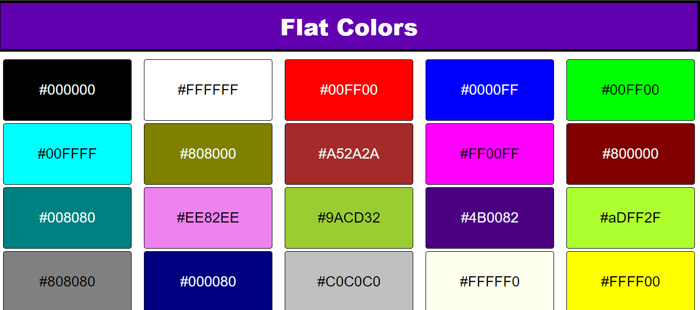

# <a href="https://hadiraza04.github.io/color-code-copier/">Color Code Picker</a>

## Project Overview

Color Code Picker (Made using HTML5 CSS3 and JavaScript)

You can see the website live at: https://hadiraza04.github.io/color-code-copier/

ABOUT THIS PROJECT-:

  1. In this project, I have created a simple div boxes using HTML CSS and JavaScript.
  2. You can see colors in these boxes and you can simple click on box to copy color code.
  3. You can easily paste it anywhere you want.